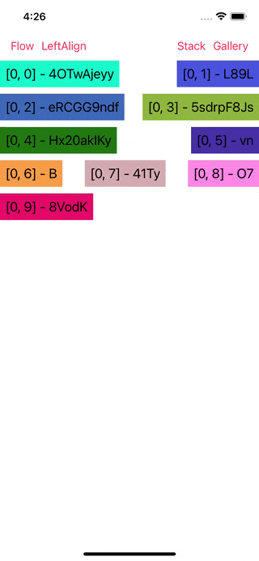

# WWCollectionViewLayout

[](https://developer.apple.com/swift/) [](https://developer.apple.com/swift/)  [](https://developer.apple.com/swift/) [](https://developer.apple.com/swift/)

## [Introduction - 簡介](https://swiftpackageindex.com/William-Weng)
- UICollectionViewLayout collection.
- UICollectionViewLayout集合。

## [Achievements display - 成果展示](https://www.hkweb.com.hk/blog/ui設計基礎知識：引導頁對ui設計到底有什麼作用/)


## [Installation with Swift Package Manager - 安裝方式](https://medium.com/彼得潘的-swift-ios-app-開發問題解答集/使用-spm-安裝第三方套件-xcode-11-新功能-2c4ffcf85b4b)

```bash
dependencies: [
    .package(url: "https://github.com/William-Weng/WWCollectionViewLayout.git", .upToNextMajor(from: "1.0.0"))
]
```

## Function - 可用函式

|函式|功能|
|-|-|
|layout()|建立Layout|

## Example - 程式範例
```swift
import UIKit
import WWCollectionViewLayout

final class ViewController: UIViewController {
    
    @IBOutlet weak var myCollectionView: UICollectionView!
    
    override func viewDidLoad() {
        super.viewDidLoad()
        initSetting()
    }
    
    @IBAction func flowLayout(_ sender: UIBarButtonItem) {
        
        let layout = WWCollectionViewLayout.Flow.layout()
        
        layout.itemSize = CGSize(width: 60, height: 60)
        layout.sectionInset = .zero
        updateLayout(layout)
    }
    
    @IBAction func stackLayout(_ sender: UIBarButtonItem) {
        
        let layout = WWCollectionViewLayout.Stack.layout()
        
        layout.itemSize = CGSize(width: 200, height: 200)
        layout.angles = [0, -15, -30, 15, 30]
        updateLayout(layout)
    }
    
    @IBAction func galleryLayout(_ sender: UIBarButtonItem) {
        
        let layout = WWCollectionViewLayout.Gallery.layout()
        
        layout.itemSize = CGSize(width: 100, height: 100)
        layout.scale = 1.2
        updateLayout(layout)
    }
    
    @IBAction func LeftAlignLayout(_ sender: UIBarButtonItem) {
        
        let layout = WWCollectionViewLayout.LeftAlign.layout()
        layout.estimatedItemSize = CGSize(width: 100, height: 100)

        updateLayout(layout)
    }
}

extension ViewController: UICollectionViewDataSource {
    
    func collectionView(_ collectionView: UICollectionView, numberOfItemsInSection section: Int) -> Int {
        return 10
    }
    
    func collectionView(_ collectionView: UICollectionView, cellForItemAt indexPath: IndexPath) -> UICollectionViewCell {
        
        let cell = collectionView._reusableCell(at: indexPath) as MyCollectionViewCell
        cell.configure(with: indexPath)
        
        return cell
    }
}

extension ViewController: UICollectionViewDelegate {}

private extension ViewController {
    
    func initSetting() {
        myCollectionView._delegateAndDataSource(with: self)
    }
    
    func updateLayout(_ layout: UICollectionViewLayout, animated: Bool = true) {
        myCollectionView.collectionViewLayout.invalidateLayout()
        myCollectionView.setCollectionViewLayout(layout, animated: animated)
    }
}
```

